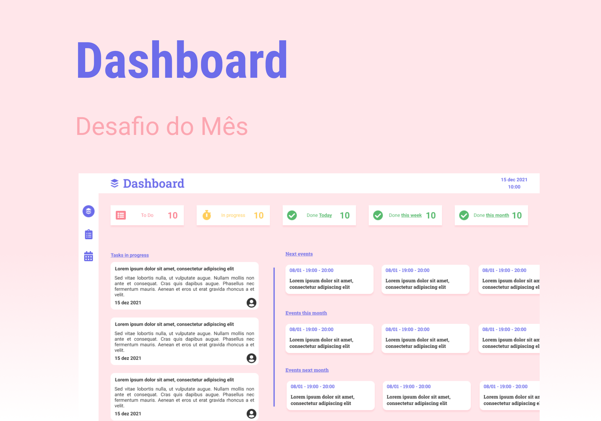

# Dashboard

Projeto desenvolvido junto com a comunidade Dev Girls Mentor.

## Preview

Layout criado por [Nury](https://github.com/nurycaroline)

Figma do projeto completo: [DASHBOARD](https://www.figma.com/file/qZBVxW8qmygFJBKjWusTMX/Dashboard-ToDo?node-id=1%3A11)



## Como rodar o projeto?

```
  yarn/npm
```

```
  yarn start/npm start
```

Projeto desenvolvido em live coding, junto com a comunidade [Dev Girls Mentor](https://discord.com/invite/8m8ByW8raM). A comunidade foi criada com o intuito de ajudar mulheres a ingressarem na área de TI. Para participar entre no link citado a pouco.

❤️
